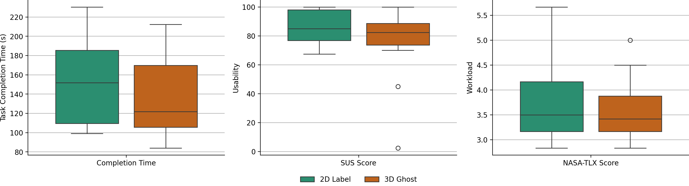
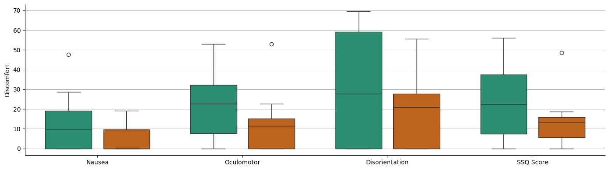

# Thesis Results Analysis

Data analysis pipeline for a master's thesis user study comparing **2D Label** and **3D Ghost** situated visualization conditions in a VR-simulated AR industrial training task.

## Overview

This repository contains a Jupyter Notebook that:

- Loads raw study datasets exported as CSV files
- Merges them using `Scene` and `Participant`
- Creates a processed **wide-format** dataset
- Converts the merged table to **long format** (`variable` / `value`) for plotting
- Calculates descriptive statistics for the main study metrics
- Produces comparison **boxplot figures** and saves them as PNG files
- Summarizes the main results with numbers

## Visualizations

### Completion Time, SUS, and NASA-TLX

### Discomfort / SSQ Metrics

## Key Findings

This analysis was conducted on data from a controlled user study with **24 participants**, comparing **2D Label** and **3D Ghost** visualization conditions.

- The **3D Ghost** condition had a lower median task completion time (**121.72s**) than the **2D Label** condition (**151.97s**), showing a **19.9% reduction**.
- The **2D Label** condition had a slightly higher median SUS usability score (**85.0**) than the **3D Ghost** condition (**82.5**). Both conditions were above the common SUS benchmark of **68**.
- The **3D Ghost** condition showed slightly lower median workload based on NASA-TLX (**3.42**) compared with the **2D Label** condition (**3.50**), showing a **2.4% reduction**.
- Overall discomfort was lower in the **3D Ghost** condition, with a median SSQ score of **15**, compared with **27** for the **2D Label** condition, showing a **44.4% reduction**.
- The **3D Ghost** condition also showed lower median discomfort subscale scores for nausea (**0.00 vs. 9.54**), oculomotor strain (**11.37 vs. 22.74**), and disorientation (**20.88 vs. 27.84**).

Overall, the results suggest that **3D Ghost guidance may support faster task completion and lower discomfort**, while **2D Labels showed slightly higher perceived usability**.

## Tools and Technologies

- Python
- Pandas
- Matplotlib
- Seaborn
- Jupyter Notebook
- Data cleaning and transformation
- Questionnaire analysis
- Boxplot visualization

## Files

- `_results.ipynb` — main notebook for loading, merging, reshaping, analyzing, and plotting the study data
- `CompletionTime.csv` — raw task completion time data
- `Nasa.csv` — raw NASA-TLX workload data
- `SSQ.csv` — raw Simulator Sickness Questionnaire data
- `SUS.csv` — raw System Usability Scale data
- `data_short_format.csv` — generated wide-format dataset, one row per participant and condition
- `data_long_format.csv` — generated long-format dataset used for plotting
- `img-results1.png` — boxplots for Completion Time, SUS Score, and NASA-TLX Score
- `img-results2.png` — boxplots for SSQ/discomfort metrics

## Expected input CSV files

These raw files should be in the same folder as `_results.ipynb` before running:

- `CompletionTime.csv`
- `Nasa.csv`
- `SSQ.csv`
- `SUS.csv`

Each dataset includes the shared identifiers:

- `Scene`
- `Participant`

## How to run

1. Make sure the required Python libraries are available:
   - `pandas`
   - `matplotlib`
   - `seaborn`
2. Open `_results.ipynb` in Jupyter Notebook.
3. Run all cells.

## Outputs

After running the notebook, you will have:

- Merged dataset: `data_short_format.csv`
- Long-format dataset: `data_long_format.csv`
- Figures: `img-results1.png`, `img-results2.png`
